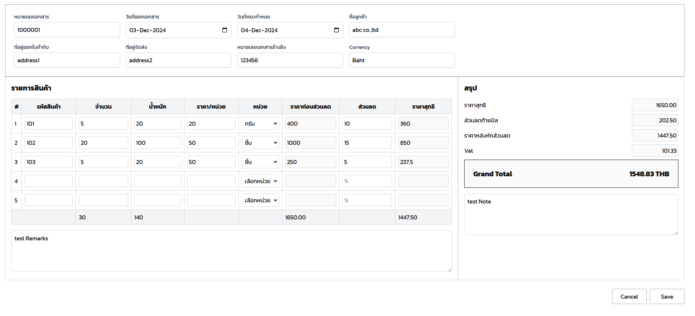
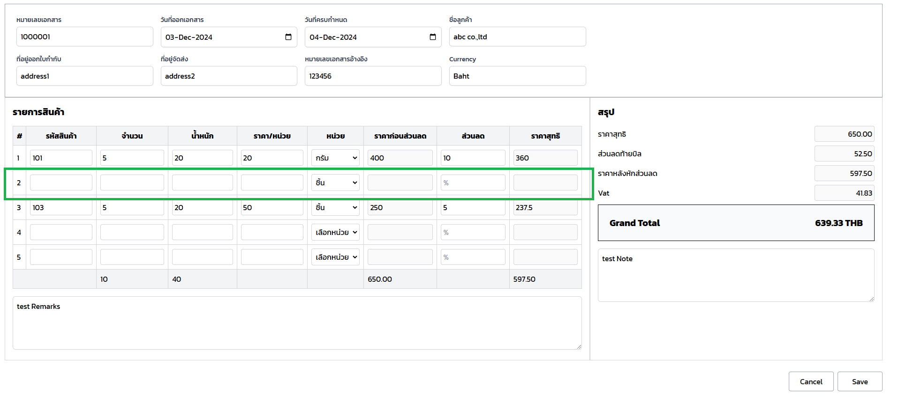
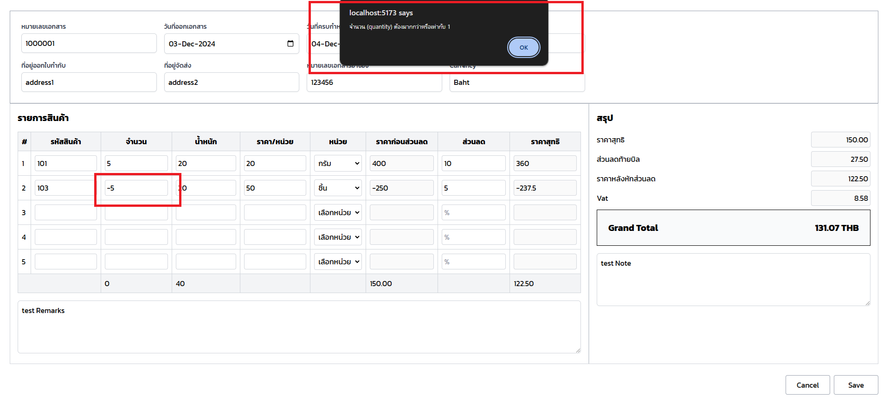

## สิ่งที่ user ต้องการใน module นี้

1. **เลือกหน่วย**: เลือกหน่วยเป็นชิ้นหรือกรัม
   

2. **เพิ่มรายการสินค้า**: เพิ่มรายการสินค้าได้ไม่จำกัด (หากพิมพ์บรรทัดสุดท้าย บรรทัดต่อไปจะเพิ่มเองโดยอัตโนมัติ)
   

3. **ลบรายการที่ทำผิด**: ลบรายการที่ทำผิด หลังจากกด Save จะบันทึกรายการเท่าที่มีอยู่ (ตัวอย่างในรูปจะบันทึกแค่ 2 รายการ)
   
   

4. **จัดการหลังการบันทึก**:
   - **แก้ไขรายการ**:
     
     
   
   
     

4. **การ validate ข้อมูล**:
      
