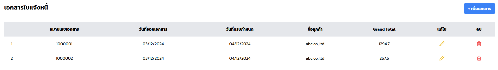

## สิ่งที่ user ต้องการใน module นี้

1. **เลือกหน่วย**: เลือกหน่วยเป็นชิ้นหรือกรัม
   

2. **เพิ่มรายการสินค้า**: เพิ่มรายการสินค้าได้ไม่จำกัด
   

3. **ลบรายการที่ทำผิด**: ลบรายการที่ไม่ถูกต้องได้ง่ายดาย
   

4. **จัดการหลังการบันทึก**:
   - **แก้ไขรายการ**:
     
     
   
   - **ลบรายการ**:
     